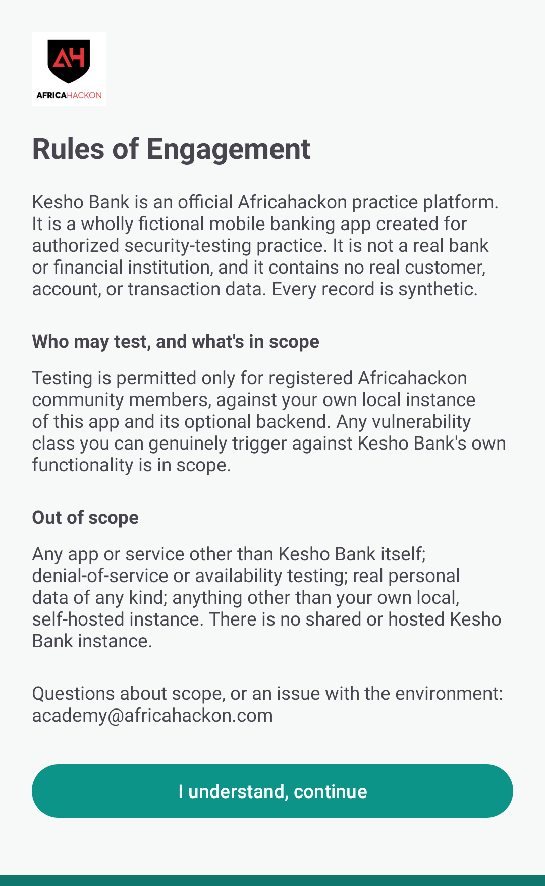
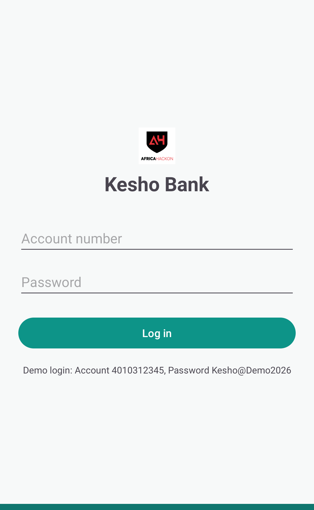
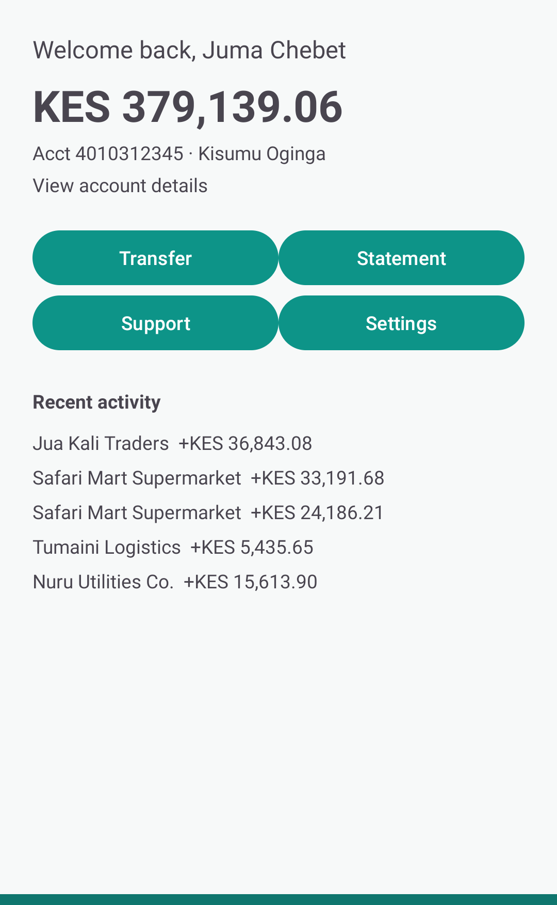

# Kesho Bank

Kesho Bank is a fictional mobile banking app, deliberately built with real, exploitable
vulnerabilities for hands-on Android security practice. It is an official Africahackon
practice platform.

Kesho Bank is not a real bank or financial institution, and contains no real customer,
account, or transaction data. Every record is synthetic.

Full rules of engagement: `docs/RULES_OF_ENGAGEMENT.md`, and in-app from Settings, View
Rules of Engagement.

## What you get

A signed, installable Android app covering 20 vulnerabilities across the OWASP Mobile Top
10: insecure local storage, exported components reachable from another app, a WebView
JS-bridge leak, weak crypto, and more. Fourteen of them are fully self-contained in the app;
the other six need the small optional backend in `backend/` running. See
`docs/VULNERABILITY_CATALOG.md` for the full list.

This mirrors a real mobile pentest engagement: you're handed a compiled app, not source.
Reverse-engineering the APK (`jadx`, `apktool`) is part of the intended exercise.

## Screenshots

Rules of Engagement:



Login:



Dashboard, with seeded synthetic demo data:



## Getting the app

Download `app-release.apk` from this repo's
[Releases](../../releases) page. Each release includes a SHA-256 checksum in its notes;
verify it before installing:

```bash
sha256sum app-release.apk
```

Then install it on an emulator or a physical device with USB debugging enabled:

```bash
adb install app-release.apk
```

Or transfer the APK to the device and open it directly (you'll need to allow installs from
your file manager/browser the first time).

**Demo login**: account `4010312345`, password `Kesho@Demo2026` (shown on the login screen
too).

## The optional backend

Six of the twenty vulnerabilities live server-side. Without the backend running, the app
still works fully for the other fourteen; the Statement/Support screens just show a
"can't reach Kesho servers" state.

```bash
cd backend
cp .env.example .env
docker compose up -d --build
```

The app's Settings screen has a Server URL field, defaulting to `http://10.0.2.2:4000`,
the standard Android-emulator alias for your host machine's `localhost`. See
`backend/README.md` for details, including the two seeded demo accounts.

## Building from source

You don't need to build from source to use the app (see "Getting the app" above), but the
full source is here if you want to read it, modify it, or build your own APK:

```bash
git clone <this-repo-url> kesho-bank-android
cd kesho-bank-android
./gradlew assembleDebug
```

Requires a JDK 17+ and the Android SDK (`ANDROID_HOME` set); Gradle's own wrapper handles
the rest. Needs Gradle 9.5.x specifically, since AGP 8.13's Gradle-internal-API usage
breaks on Gradle 9.6+.

## Companion PoC apps

`companion-poc-apps/` contains two small apps, provided as source only (never distributed
as built APKs), that demonstrate several findings are reachable from a genuinely separate
installed app rather than just an adb shell:

- `malicious-second-app`: launches Kesho Bank's exported components directly.
- `tapjacking-overlay`: a real overlay-based tapjacking PoC against PIN entry.

Build and install them the same way as the main app (`./gradlew :companion-poc-apps:<name>:assembleDebug`).

## Reverse-engineering tools

`jadx` and `apktool` for decompilation, `adb` for device interaction, Frida/`objection` for
runtime instrumentation, and Burp Suite (or another intercepting proxy) for the
backend-tied findings. Set your proxy in the emulator's Wi-Fi settings and install Burp's
CA certificate on the device for HTTPS interception.
